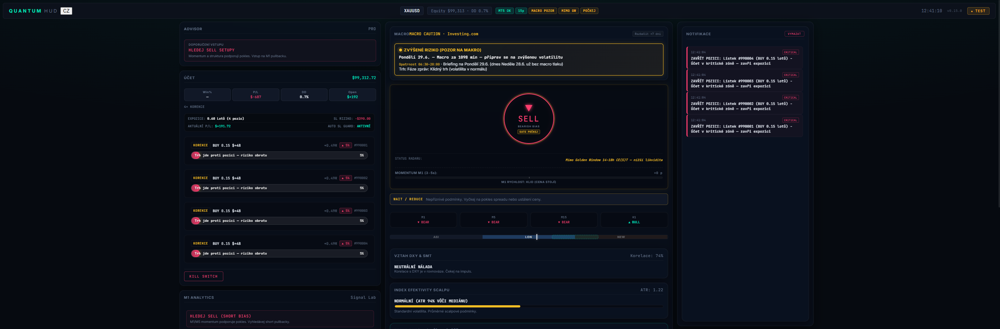

<div align="center">

# ⚡ Quantum HUD

**Real-time XAUUSD scalp cockpit for MetaTrader 5**

Prop rules · Macro gate · Liquidity RADAR · Per-position trend alignment %

[](config.py)
[](https://www.python.org/)
[]()
[]()

[Quick start](#-quick-start) · [Features](#-features) · [TEST mode](#-test-mode-no-mt5) · [Trend % guide](#-position-trend--how-to-read-it) · [Česky](#-česky)

</div>

---

## 📸 Preview — TEST replay mode

> Offline demo with saved snapshot — no broker connection required.

<p align="center">
  
</p>

<p align="center">
  <sub>Decision RADAR · open positions with trend % · macro caution · notification center</sub>
</p>

---

## 🎯 What it does

Quantum HUD sits beside your MT5 terminal and answers **three questions every second**:

| # | Question | Where to look |
|---|----------|---------------|
| 1 | **Should I enter now?** | Gate (ANO / POČKEJ / NE), Golden Window, spread, macro, prop DD |
| 2 | **What is the market doing?** | M1 analytics, liquidity RADAR, MTF strip, DXY/SMT |
| 3 | **Should I keep this position?** | Per-trade trend alignment **%** + action badge |

Built for **XAUUSD** intraday scalping — dark, information-dense UI with a compact **kompakt** layout.

---

## ✨ Features

<table>
<tr>
<td width="50%" valign="top">

### 🛰 Decision RADAR
Unified BUY/SELL bias ring, gate reason, momentum meter, session liquidity balance bar.

### 📊 Position manager
**DRŽET** · **KOREKCE** · **CHRÁNIT** · **ZAVŘÍT**  
+ trend support bar with precise **0–100 %** per open trade.

### 📅 Macro panel
High-impact calendar, countdown, block / caution / clear states with market reaction.

</td>
<td width="50%" valign="top">

### 🏷 Header status pills
Live equity, DD, MT5, spread, macro, Golden Window, gate — at a glance.

### 🧪 TEST replay
Replay `test_data/default_snapshot.json` at configurable M1 speed — perfect for demos.

### 🌐 CZ / EN
Language toggle next to QUANTUM HUD logo; BAT launchers ask Czech or English on start.

</td>
</tr>
</table>

---

## 📈 Position trend % — how to read it

The **% bar** shows how strongly the market supports **your position direction** (not the action badge).

| % | Meaning | Your mindset |
|---|---------|--------------|
| **≥ 85** | Ultra strong trend in your favor | Hold with confidence |
| **70 – 84** | Strong trend support | Thesis intact |
| **50 – 69** | Pullback / correction | Watch the chart closely |
| **30 – 49** | Weak support, correction | Stay alert |
| **< 30** | Market against your position | High reversal risk |

> **Badge vs bar:** `DRŽET` at 21 % means the system has not called exit yet — but the trend does **not** support you. Watch the chart.

---

## 🚀 Quick start

### 1 · First-time setup

Double-click **`Nastaveni.bat`** → choose **C** (Czech) or **E** (English) → wizard creates `.env` with MT5 credentials.

### 2 · Live dashboard

```bat
Spustit_Quantum_HUD.bat
```

- Opens **http://127.0.0.1:8050**
- Connects to running MT5 terminal
- Pick **E** at BAT prompt or set `HUD_UI_LANG=EN` for English UI

### 3 · TEST mode (no MT5)

```bat
Spustit_Quantum_HUD_TEST.bat
```

- Replays snapshot from `test_data/default_snapshot.json`
- Default: **30 s per M1 bar** (`TEST_M1_BAR_SECONDS=30`)
- Header shows **TEST** badge

To capture your own snapshot while MT5 is live → **`Ulozit_test_data.bat`**

---

## ⚙️ Configuration

| Variable | Default | Purpose |
|----------|---------|---------|
| `HUD_UI_LANG` | `CZ` | UI language (`CZ` or `EN`) |
| `HUD_MODE` | `live` | Set to `test` for replay |
| `TEST_M1_BAR_SECONDS` | `30` | Real seconds per M1 bar in TEST |
| `TEST_SNAPSHOT` | `test_data/default_snapshot.json` | Replay data file |
| `STARTING_BALANCE` | `25000` | Display reference (equity from MT5) |

See `.env.example` and `.env.test.example` for the full list.

---

## 🗺 Layout overview

```
┌──────────────────────────────────────────────────────────────────┐
│  QUANTUM HUD [CZ|EN]    XAUUSD · Equity · status pills      TEST │
├───────────────┬────────────────────────────┬─────────────────────┤
│ Account       │ Decision + RADAR           │ Session             │
│ Positions     │ Macro / M1 analytics       │ Timeline            │
│ Trend % bar   │ MTF · Chart                │ Next event          │
└───────────────┴────────────────────────────┴─────────────────────┘
```

After updates, hard-refresh the browser (`Ctrl+Shift+R`) or open `?build=0.15.0`.

---

## 🛠 Development

```powershell
git clone https://github.com/panzmoravylab/QuantumHUB.git
cd QuantumHUB
python -m venv .venv
.venv\Scripts\activate
pip install -r requirements.txt
python -m pytest tests/ -q
```

Current version: **v0.15.0** — see `config.py` → `HUD_VERSION`.

---

## ⚠️ Disclaimer

This software is for **informational and educational purposes** only. It is not financial advice. Trading leveraged instruments involves substantial risk. You are solely responsible for your trading decisions.

---

## 🇨🇿 Česky

**Quantum HUD** je real-time dashboard pro scalp obchodování **XAUUSD** nad MetaTrader 5.

- **Gate** — mám vstoupit teď, nebo počkat?
- **RADAR** — kam teče likvidita a jaký je bias?
- **Pozice** — u každého obchodu **% podpory trendu** (např. BUY + 84 % = trh stále táhne nahoru; 21 % = korekce / trh proti tobě)

| Soubor | Účel |
|--------|------|
| `Nastaveni.bat` | První konfigurace `.env` |
| `Spustit_Quantum_HUD.bat` | Live režim s MT5 |
| `Spustit_Quantum_HUD_TEST.bat` | Replay bez MT5 |
| Přepínač **CZ / EN** | V hlavičce u loga QUANTUM HUD |

---

<div align="center">

**[panzmoravylab/QuantumHUB](https://github.com/panzmoravylab/QuantumHUB)** · Contributions welcome via pull request

</div>
